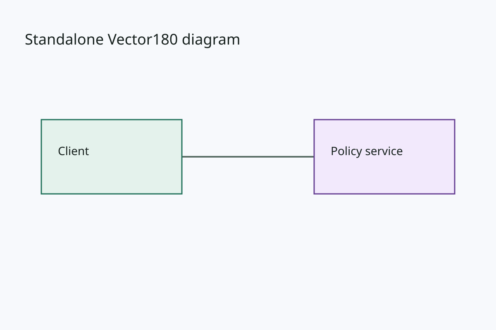

# Vector180 deck manuscript

<!-- freshness: 2026-08-04 -->

**Status:** design proposal; not current syntax or compiler behavior

## Decision

Bank a strict Markdown shell for an ordered presentation, with one referenced
Vector180 SVG atom per slide and optional speaker notes. The shell is valuable
when the deliverable has a narrative sequence. A diagram suite with no
presentation order remains a plain directory of independent atoms.

Authority is deliberately split:

| Concern | Sole authority |
| --- | --- |
| Deck title, slide order, stable slide IDs | Markdown manuscript |
| Intent, presenter narrative, speaker notes | Markdown manuscript |
| Visible text, geometry, style, painter order | Referenced Vector180 SVG atom |
| Review branch | Generated PPTX |

PPTX is never canonical. Markdown never restates visible slide content as a
second render source. A heading helps people navigate the manuscript but does
not generate a title shape.

PowerPoint speaker notes are the correct projection for presenter narrative.
PowerPoint comments remain review annotations and are not an authoring
surface. PresentationML models a Notes Slide part for a slide with notes and
an optional shared Notes Master for formatting; comments use a separate
review-oriented part model. See Microsoft's
[PresentationML structure](https://learn.microsoft.com/en-us/office/open-xml/presentation/structure-of-a-presentationml-document),
[Notes Slide](https://learn.microsoft.com/en-us/office/open-xml/presentation/working-with-notes-slides),
and
[Comments](https://learn.microsoft.com/en-us/office/open-xml/presentation/working-with-comments)
documentation.

## Proposed minimal source

Use ordinary CommonMark plus strict JSON directives in inert HTML comments:

```markdown
<!-- office180-deck {"schema":"office180-deck-manuscript/0.1","id":"office180-primer","canvas":[1600,900],"suite":"office180-primer@1"} -->
# Office180 primer

## Exact source stays authoritative

<!-- office180-slide {"id":"authority","sha256":"0123456789abcdef0123456789abcdef0123456789abcdef0123456789abcdef","focus":["source.title","source.office-branch"]} -->


> **Intent:** Establish that Office files are editable branches, never source authority.

### Speaker notes

Trace the source branch first. Then explain how the map authenticates the
editable Office branch before reconciliation.
```

The first version should remain intentionally small:

- exactly one deck directive before one H1 title;
- source-ordered H2 sections are the sole slide-order declaration;
- exactly one slide directive and one local `*.vector180.svg` image reference
  per H2 section;
- stable slide IDs are independent of headings and filenames;
- the directive binds exact atom bytes with lowercase SHA-256;
- optional `focus` entries name stable object IDs whose changes make narrative
  review stale;
- one short Intent blockquote and a plain-text/bullet Speaker notes section;
  and
- a required `1600 × 900` identity canvas until a later placement contract
  exists.

Reject duplicate or unknown JSON keys, duplicate slide IDs, URLs, absolute
paths, path traversal, missing atoms, hash mismatches, invalid Vector180
sources, focus IDs that do not resolve, and any extra image in a slide section.
Arbitrary HTML other than the two exact directive comments, executable
content, arbitrary rich Markdown, notes images, and embedded Office
instructions stay outside the first profile.

Do not add visible-text interpolation in the first version. Stable `focus` IDs
give useful semantic coupling without duplicating or templating text. A linter
may warn when speaker notes appear to copy a long visible line literally.

## Agent-efficiency model

An agent can read one compact manuscript to understand the complete deck
sequence and intent, then load only the atom for the slide it is editing.
Normal inspection should be:

1. scan deck metadata and H2 order;
2. validate hashes and focus IDs without resolving every compiler object;
3. use `outline`, `show`, `text`, or `diff` on selected atoms;
4. resolve and measure only changed or export-bound atoms; and
5. compile the complete deck only at the delivery boundary.

Proposed narrow commands are:

```text
vector180 deck-md validate MANUSCRIPT
vector180 deck-md show MANUSCRIPT --slide ID
vector180 deck-md lock MANUSCRIPT --review-diff
vector180 deck-md assemble MANUSCRIPT --output DECK.pptx --map DECK.map.json
```

`lock` must never silently bless changed atom bytes. It should show the C12
semantic diff from the last authenticated atom when available, mark focused
object changes prominently, and write a separate candidate manuscript.

## PPTX projection

Compilation should parse the manuscript into a typed assembly input rather
than smuggling notes into SVG metadata:

```text
Markdown shell
  ├── order / intent / speaker notes
  └── exact atom references
        └── validated Vector180 resolved slides
              └── deterministic PPTX + authenticated map
```

For every slide containing notes, the successor compiler needs:

- `ppt/notesSlides/notesSlideN.xml` and its relationship part;
- a relationship from the slide to its Notes Slide;
- relationships from the Notes Slide back to the slide and to one shared Notes
  Master;
- one shared Notes Master, relationship part, and deterministic notes theme;
- the Presentation relationship and `p:notesMasterIdLst`;
- Notes Slide and Notes Master content-type declarations; and
- the correct notes count in `docProps/app.xml`.

Use the corresponding slide part number for `notesSlideN`. Preserve the
current deterministic stable-ID numbering discipline. Omitting notes must
retain the current no-notes package behavior byte-for-byte.

## Provenance and reconciliation

The current single-atom map is not enough. A successor map must authenticate:

- exact manuscript bytes and schema;
- deck and slide IDs plus slide order;
- every local atom path and exact atom SHA-256;
- each notes projection digest;
- focused object IDs and their semantic snapshot;
- every emitted notes part and relationship; and
- final package bytes.

The first release should be compile-only for notes. Supported visual edits may
still reconcile through stable IDs, but a native speaker-note edit must return
`review-required` with:

- the slide ID;
- baseline and edited note digests;
- a bounded, privacy-conscious plain-text candidate;
- the exact affected package parts; and
- a proposed next action.

Never discard or silently overwrite a note edit. Recovering edited PowerPoint
notes back into Markdown needs its own typed, hash-bound manuscript patch and
three-way merge contract.

## Relationship to current contracts

This proposal does not change Vector180 0.1, C7, C9, or C10:

- C7 deliberately accepts an exact no-notes OPC graph;
- C9 maps exactly one atom/slide today;
- C10 correctly classifies new notes parts as unsupported inventory; and
- the current implementation plan lists notes as a non-goal.

Before implementation, promote this design into a versioned successor
contract, bank a small PowerPoint-created notes corpus, and define the new map
schema. OpenDocKit's existing plain speaker-note extraction is useful as an
independent read oracle, but native PowerPoint save/reopen remains required
evidence for the emitted graph.

## Delivery sequence

1. Freeze this grammar with positive, counterexample, size, and path-security
   fixtures.
2. Bank a minimal native PowerPoint notes fixture and exact save/reopen
   variant.
3. Implement the parser and low-context inspection commands independently.
4. Add opt-in deterministic notes emission without changing no-notes bytes.
5. Add the successor multi-slide map and atomic publication.
6. Accept unchanged or native-normalized notes during reconciliation; report
   edits without applying them.
7. Define manuscript patch and merge semantics before reverse note editing.
8. Gate through strict OPC/schema checks, OpenDocKit, native PowerPoint, and
   human notes-pane review.
